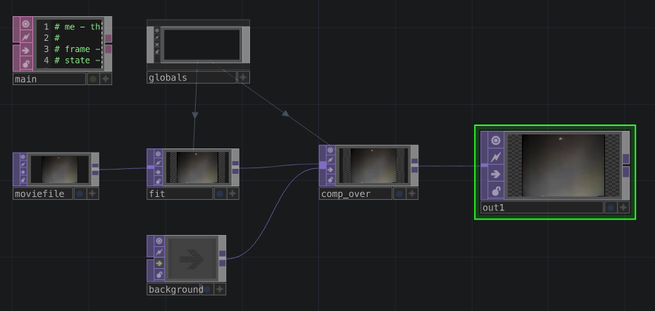

# Template TouchDesigner pour TIM Montmorency

Template de projet TouchDesigner pour les étudiants en TIM à Montmorency. Tout nouveau projet TouchDesigner devrait partir de ce template.

Ce dépôt fourni :
- Un `.gitignore` spécifique à TouchDesigner qui permet d'ignorer les fichiers de backup (git s'occupe des sauvegardes et le système de TouchDesigner devient redondant).
- Un `template.toe` qui comprend :
    - Un `DAT Execute` nommé `main` pour tout le code Python 
    - Un `COMP Base` nommé `globals` pour les variables globales
    - Un `TOP Fit` nommé `fit` qui montre comment préserver le ratio d'une image.
- Un fichier vidéo d'exemple.

## `DAT Execute` nommé `main` 

Le `DAT Execute` nommé `main` devrait contenir le code Python à exécuter à chaque *frame*. Idéalement, tout le code Python devrait se trouver ici plutôt qu'être éparpillé. Il faut surtout éviter d'utiliser des `CHOP Execute` qui dédoublent l'exécution du code. Les fonctions pertinentes du `DAT Execute` nommé `main` sont :
- `onStart()`, le code exécuté à l'ouverture du document.
- `onFrameStart()`, le code exécuté à chaque *frame* (environ 60 fois par seconde). 

Pour accéder aux variables globales de l'exemple, dans du code Python ailleurs ou dans l'inspecteur de paramètres, écrire :
- `op('globals').par.Resx`
- `op('globals').par.Resy`

## `COMP Base` nommé `globals`

Le `COMP Base` nommé `globals` permet de définir des paramètres qui servent en tant que variables globales. Pour ajouter de nouvelles variables, il faut faire un clic droit sur le `COMP Base` et choisir l'option `Customize Component`. 

Deux globales ont été définies en tant qu'exemple :
- `Resx` : la résolution horizontale de sortie finale.
- `Resy` : la résolution verticale de sortie finale.

Le `TOP Composite` et le `TOP Fit` utilisent les variables `Resx` et `Resy` pour leurs paramètres `Common > Output Resolution`. En changeant la valeur de ces variables, cela modifie la résolution de la sortie finale.

## `TOP Fit` nommé `fit`

- Le `TOP Fit` nommé `fit` montre comment préserver le ratio d'une image (trop souvent les images sont étirées dans TouchDesigner). La vidéo d'exemple a un ratio de `4:3` et la sortie un ratio de `16:9`. Le `TOP Fit` nommé `fit` permet de préserver le ratio d'origine. Les paramètres pertinents :
- `Common > Output Resolution` : utiliser les variables `Resx` et `Resy` pour la résolution de sortie
    - `op('globals').par.Resx`
    - `op('globals').par.Resy`
